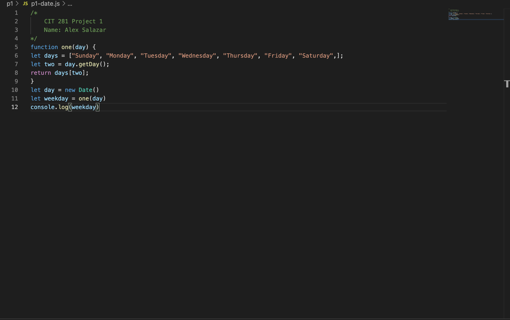

## Welcome to Project 1

This weeks project was a review from CIS 111 and learn how to use the terminal.

After completing this project, you will:

Gain experience accessing your operating system's command line interface (CLI)

Gain experience working with CLI commands

Gain experience working with Visual Studio Code (VSCode)

Gain experience writing and executing non-web server Node.js JavaScript code

